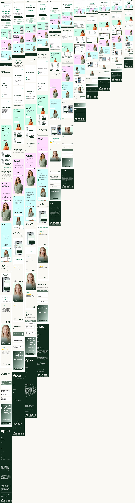

# Apsu 首页

[](https://github.com/Jackzz119/apsu-home-page/actions/workflows/ci.yml)

Apsu 首页（桌面 1440 / 移动 375），用 Next.js 16 App Router 页面 + 一套小型 React 组件库实现，配 Storybook、有真实 HTTP 边界的模拟后端，以及一套每次会话都留档的 AI 辅助工作流。线上：[首页](https://apsu-home.vercel.app) · [Storybook](https://apsu-home-storybook.vercel.app)，每次 push `main` 自动重发。

English version: [README.md](README.md).

## 快速开始

甲方只需要四条命令，不用装别的、不用配置。测试环境是 Node 22 LTS（最低 20.9），lockfile 精确锁定每个依赖版本，`npm install` 在任何机器上装出同一棵树。

```bash
npm install
npm run build        # 生产构建
npm run dev          # http://localhost:3000
npm run storybook    # http://localhost:6006
```

- `npm test`：110 条 Node 测试（数据契约、token、BMI 计算、素材、交付验收），一秒内跑完，每次提交前都跑得起。
- `npm run test:ui`：48 条 Chromium 用例，对 Storybook 与页面在 375 / 1440 两个视口做真实键盘、指针、减动效行为测试，不是截图对比。
- `npm run check:responsive`：从 320 到 1920 共 11 个宽度量页面，重写[响应式报告](docs/responsive-report.md)。
- `npm run lint` / `typecheck` / `format:check` / `check:tokens` 是静态门禁；`check:tokens` 拒绝 token 文件之外的任何颜色、长度字面值。

不需要任何环境变量。以上全部在 [CI](#持续集成) 的 Linux 上再跑一遍，所以四条命令在作者机器之外也确认能跑。

## 项目结构

目录按职责分，不按文件类型分：路由薄、组件是库、内容是数据，AI 过程全部与代码一起入库。甲方按「契约 → 组件库 → 页面」的顺序读，就能理解整个产品。

```text
app/                  路由：根布局、单页首页、GET /api/home（模拟后端）
components/index.ts   组件库唯一出口
components/ui/        11 个可复用原语（Button、Chip、Card、Accordion、Carousel、Marquee……）
components/sections/  14 个首页区块，只吃 props
content/schema.ts     页面的 Zod 契约 = 未来的 API 契约
content/mocks/        照抄源稿的数据、素材登记、Storybook 标签
lib/                  取数、BMI 计算、动效 token、输入方式与减动效 hook
styles/tokens.css     设计 token：颜色、字阶、间距、圆角、阴影、动效
public/images/        设计导出图，带真实尺寸
tests/                Node 测试、浏览器用例、按甲方要求逐条推导的验收测试
scripts/              token 守卫、11 宽扫描、AI 日志同步与可读导出
docs/                 偏差日志、响应式证据、素材来源、评审记录
ai/                   规划文档、领域规范、设计系统、技能（中文）
ai-logs/              原始 AI 会话、校验清单、会话索引、可读版
.github/workflows/    CI
```

- 区块从不 import mock——页面取一次数据往下传 props，任何区块换内容就能复用。
- `components/index.ts` 是页面唯一的 import 路径——页面只是这个库的一个消费者。
- `ai/` 与 `ai-logs/` 有意入库——甲方要求 AI 过程可审，规划与会话记录就放在它们产出的代码旁边。

结果是：加一个区块 = 一个组件、一个 story、一个 schema 字段；代码是怎么做出来的没有任何隐藏。同样的布局加页面只要在 `app/` 下加路由，不动组件库。

## 数据层与 API 契约

现在没有后端，所以数据的形状就是契约。它只写一次（Zod schema），推导成 TypeScript 类型，在每个边界校验，并由一个 Route Handler 像未来的 API 一样提供。切换真后端是改配置，不是改代码。

- [content/schema.ts](content/schema.ts) 按阅读顺序定义 `HomePage`，14 个区块——所有类型都是 `z.infer`，只有一个真源，没有手写 interface 会漂移。
- 严格对象、整数分、带真实尺寸的本地图片路径、可辨识联合（引言 / 照片证言，聊天 / 图片卡片，公制 / 英制单位）——非法或多余的数据直接报错，不会渲染出半对不对的东西。
- 动作分 `anchor` / `external` / `demo`——设计里没有目的地的控件（Login、Contact、社交图标）被声明为 demo，永远不会误导航、误请求。
- [lib/api/home.ts](lib/api/home.ts) 是唯一入口 `getHomePage()`——没配 URL 就直接 import 并校验 mock（构建期零 HTTP）；配了 `NEXT_PUBLIC_API_URL` 就请求 `${url}/api/home`，检查状态码并用同一份 schema 校验。
- [app/api/home/route.ts](app/api/home/route.ts) 返回同一份校验过的 mock——HTTP 边界今天就在，以后接真服务只改一个环境变量。

```bash
curl --fail http://localhost:3000/api/home                 # 模拟后端
NEXT_PUBLIC_API_URL=https://api.example.com npm run dev    # 把页面指向真后端
```

因为校验在网络两端都跑，后端破坏契约会在边界上得到一条可读的错误，而不是在组件深处崩掉。schema 也是产品自然生长的地方：新区块就是新字段，类型、测试、mock 随之而来。

## 设计决策

甲方把几个选择留给了我们。每个都只决定一次、写下来、处处照做；下表就是代码遵循的那张表。

| 领域       | 决定                                                              | 为什么                                   |
| ---------- | ----------------------------------------------------------------- | ---------------------------------------- |
| 设计 token | Tailwind v4 `@theme` 语义 CSS 变量，`check:tokens` 守卫           | 换主题只动一个文件；字面值漏不进组件     |
| 图片       | 本地导出图走 `next/image`，数据里带 `{ src, alt, width, height }` | alt 是内容；已知尺寸防止布局抖动         |
| 状态       | 局部 `useState` / `useReducer`；BMI 是 `lib/bmi.ts` 里的纯函数    | 单页站不需要 store；纯计算最好测         |
| 路由       | 只有 `/`；产品链接滚到区块锚点                                    | 产品页不在范围内；空占位路由是噪音       |
| 动效       | CSS 优先、共享 token；Motion 包只在值得的地方用                   | 一致克制胜过数量；CSS 与 JS 共用一份预算 |
| 响应式     | `clamp()` 流式取值、三个布局断点、1440px 容器封顶                 | 两块板之间连续过渡；布局变化的位置明确   |
| 组件库     | 只吃 props 的组件从一个出口导出；页面是消费者                     | 组件不依赖页面数据或 provider 就能复用   |

先把决定写下来再动手，意味着没有哪个区块需要重新争论一遍，评审时大多数「为什么」也能直接用这张表回答。新决定进同一张表，理由和代码一样可审。

## 自适应策略

只给了两块板（375 和 1440），页面却要在 320 到 1920 的每个宽度完整。数值在两块板之间流动，布局只在三个明确断点变化，而且这个说法是量出来的，不是口头保证。

- 字号、间距、组件尺寸用 `clamp()`——两块板是每个区间的两端，中间宽度按比例插值而不是跳变。
- 断点 `sm` 640 / `lg` 1024 / `xl` 1280 和 1440px 容器封顶——只有这些地方布局真的变（堆叠、分栏、桌面头部），断点之间行为可预测。
- [scripts/check-responsive.ts](scripts/check-responsive.ts) 在 11 个宽度加载页面，断言无横向溢出、导航一行、文字不出区块——[报告](docs/responsive-report.md)每次运行重生成并入库。
- 11 个宽度从左到右拼成一张图——甲方一秒钟就能看到证据。



- BMI 计算器的错误态、结果态另在 11 个宽度全部检查，校验永远不会把表单或页面推动。

这套做法在两块板存在的地方像素保真，在没有板的地方平滑退化。扫描进了 CI，以后哪次布局改动弄坏了某个宽度会直接构建失败，不会等到甲方发现。

## 交互状态与动效

每个可交互元素都响应 hover、focus、按压，每个过渡都用同一小套时长与曲线。规则来自 Emil Kowalski 的动效方法并按本设计适配，另有一条浏览器测试对每个可见控件强制伪类，证明规则确实成立。

- 动效 token 在 [styles/tokens.css](styles/tokens.css) 与 [lib/motion.ts](lib/motion.ts) 各一份，有测试保证两边相等——160ms fast、100ms release、200ms base、250ms slow，一条 ease-out、一条 ease-in-out。
- hover 以颜色为主且只对精确指针生效；按压是 0.97 缩放；focus-visible 是立即出现的 2px 外环、不做动画——键盘用户从不等反馈。
- 减动效下移除位移、缩放和跑马灯滚动，保留短暂的颜色 / 透明度变化——内容始终可读，不会卡在动画中间。
- 原生元素优先——FAQ 用 `<details>`（量高度的可反向过渡）、移动菜单用 `<dialog>`、轮播用 scroll-snap、分段控件用真正的 radio。
- 两条跑马灯 hover / focus 暂停并配常驻 Pause 按钮；只给指针看的复制轨对读屏隐藏，键盘用户拿到静态列表。
- [tests/acceptance/states.spec.ts](tests/acceptance/states.spec.ts) 对每个可见控件强制 `:hover` / `:active` / `:focus-visible`（1440 下 65 个，375 含打开的菜单 69 个），检查样式确有变化并带过渡。

一致比多样便宜：一套 token、一套规则让 14 个区块像一个产品，验收扫描也保证以后不会有控件没有状态就上线。每个状态的完整理由见[偏差日志](docs/deviations.md)（D-01 到 D-04）。

## Storybook

Storybook 是甲方看组件库的窗口：111 个 story，一态一个，hover / focus / 按压用 pseudo-states 插件固化而不是靠鼠标。a11y 插件把任何违规当错误。

| 原语             | 覆盖的状态                                                              | Stories |
| ---------------- | ----------------------------------------------------------------------- | ------- |
| Button           | primary / secondary / outline；Hover / Focus / Pressed / Disabled；链接 | 10      |
| Chip             | 信息、选中、可交互切换、混合书写方向                                    | 9       |
| Card             | 四种底色；链接版 Hover / Focus / Pressed                                | 9       |
| Accordion        | 收起 / 展开 / Hover / Focus / Pressed / 减动效                          | 9       |
| Carousel         | 首张 / 末张 / 键盘 / 减动效 / 单张 / 空                                 | 7       |
| Marquee          | 静态 / 运行 / 暂停 / 减动效                                             | 5       |
| NumberField      | Focus / 无效 / 外部错误 / Disabled / 提示                               | 7       |
| RadioGroup       | Focus / 选中 / 禁用组或选项                                             | 6       |
| SegmentedControl | Hover / Focus / Pressed / Selected / Disabled                           | 7       |
| Rating           | 满 / 半 / 空                                                            | 4       |
| IconButton       | 五种交互态；两种变体                                                    | 7       |

- story 与组件同目录、读同一份 mock——没有第二份文案会漂移。
- 区块 story 覆盖交互岛：打开的菜单、展开 / 无效 / 已计算的 BMI、暂停的跑马灯、全展开的 FAQ。
- 两个视口预设（375 × 812、1440 × 900）对应两块板；浏览器套件在两个视口对每个原语 story 跑 axe。

每个状态都是一个有名字的 story，设计评审可以直接说「Button → Pressed」而不用描述手势，某个状态的回归不跑应用就看得见。`npm run build-storybook` 得到静态导出；上面的线上版每次 push 重建。

## 偏差日志

设计稿有真实的错误，甲方要求修正并记录。每一处与板子的差异都是 [docs/deviations.md](docs/deviations.md) 里的一条：哪里错了、改成什么、为什么——后面跟着每条的实施状态追踪表。

- C 类（12 条）修源稿问题——拼写、对比度不达标、没输入就显示的 BMI 分数、四题一样的 FAQ 答案、把两种语言黏成一个的语言 chip。
- D 类（4 条）定义静态稿画不出来的行为——hover / focus / 按压规则、运动条的常驻暂停、永不导航的 demo 控件、甲方批准的 BMI 数字递增。
- 先登记、获批、再改；上线修正的那条 commit 引用条目 id。

16 条全部批准并实施。这份日志同时是评审议程：甲方五分钟读完，就知道页面在每一处和图不一样的地方以及原因。

## 持续集成

每次 push 在 Linux 上跑一遍甲方会跑的命令，分两个 GitHub Actions job。`main` 是绿的，就证明仓库在作者之外的机器上能跑，包括大小写敏感的 import 和干净安装。

- `quality`：`npm ci` → 格式 → 类型 → lint → token 守卫 → 生产构建 → Storybook 构建 → Node 测试。
- `browser`：装 Chromium、构建应用、对 Storybook 与生产服务跑 48 条 Playwright 用例，再起生产服务跑 11 宽扫描；trace、报告与截图作为 artifact 上传。
- 七条验收测试把甲方可机检的要求映射到代码——lockfile 已提交、schema 是唯一类型源、11 宽度、交互状态、一态一 story、README 各节与链接、原始 AI 日志与校验和一致。

流程刻意朴素：除 npm 缓存外没有缓存技巧，没有掩盖不稳定的重试，历史里两次红的原因写在规划文档里而不是删掉。加一项检查就是加一个脚本、加一行。

## AI 工作流

本项目的 AI 工作流属 Cheng Zheng 私有。除引用的 Emil Kowalski 四个动效技能外，其余技能都属于开发者自己的 ADK（agent 开发套件），目的是完全契合个人开发流：skill 定义 agent 的能力、分工明确；`ai/` 文件夹管控项目上下文；`ai/features/` 把 agent 需要的上下文模块化细分、按需选择性导入会话；`ai/design_system/` 管理设计系统、保持项目设计风格统一；Claude 协议（`CLAUDE.md`）是一切的基础——在其中登记技能与 features，就是每次会话的启动协议。`shelf` 是开发者用来云存储 ADK 的 npm 公开包，同一套装备可以原样带去下一个项目。Claude Code 与 Codex 两个 agent 都按这份协议工作，而不是靠聊天推进。

- 每个 agent 一份协议（[CLAUDE.md](CLAUDE.md)、[AGENTS.md](AGENTS.md)）——每次会话开场必读；它指向项目规范与任务清单，并禁止 agent 自己改规则。
- [ai/PROJECT.md](ai/PROJECT.md) 装需求登记（每条规则追溯到甲方原文的某一句）、决策记录与 commit 规则；[ai/TODO.md](ai/TODO.md) 装 P0–P8 的阶段计划，每阶段有完成判据。
- [ai/features/](ai/features/) 下九份领域规范（结构、数据契约、token、响应式、动效、Storybook、无障碍、组件、自检）——各管一个主题，agent 只加载需要的那份，不背整段历史。
- 入库的设计系统快照（[ai/design_system/](ai/design_system/)）——Figma 节点几何、变量与整板截图通过 Figma MCP 在每月 20 次的配额内读一次，之后的会话不再花配额。
- [ai/jaSkills/](ai/jaSkills/) 下十三个技能：ADK 的九个（任务主管、功能开发流程、版本控制、UI/UX 与主美角色、技能维护、货架操作），加上固定到某个 commit 的 Emil Kowalski 四个动效技能——角色靠触发词调用，各自带检查清单。
- 先记偏差再写代码；每次 commit 前十二条自查；commit 的切分与时机由人决定，agent 从不自主提交。
- 两个 agent 在并行 worktree 里工作——Claude Code 负责规划、评审与阶段收口，Codex 完成了 P0–P6 的大部分实现——用会话存档交接，每次对话都有原始日志。

日志就是证据。[会话索引](ai-logs/README.md)说明每份记录做了什么、产出了哪些 commit；[MANIFEST.sha256](ai-logs/MANIFEST.sha256) 固定每个原始文件的校验和，并有测试同时校验两者。原始记录：Claude Code [`b88f38d4…`](ai-logs/claude-code/b88f38d4-6900-41d6-855b-a41a6443cbce.jsonl)、[`c1519747…`](ai-logs/claude-code/c1519747-7fbd-43f0-ac55-e03a5ce8c1da.jsonl)、[`0ec4e91e…`](ai-logs/claude-code/0ec4e91e-c959-4dc8-9035-54a00263f62b.jsonl)；Codex [`01a0b03c…`](ai-logs/codex/rollout-2026-09-17T09-38-57-01a0b03c-4d2e-7732-9d3d-a7e5e637ea96.jsonl) 及其两份延续。每份记录的可读 Markdown 版在 [ai-logs/readable/](ai-logs/readable/)。

换来的是：两天 96 条线性 commit、没有 squash，每个「为什么」都写在代码之前，任何会话都能只凭文档续接。同一套协议与技能从 shelf 原样取用到下一个项目，项目专属的只有九份短规范。

## 已知限制

- Login、Contact、咨询与页脚社交控件按甲方决定只做视觉演示，不接后端。
- Semaglutide 复用 Tirzepatide 药瓶图（C-12），因为没有别的药瓶导出图；标签与产品不符。
- BMI 是筛查数值不是诊断；性别保留为表单选项但不参与计算。
- 字体来自 `next/font/google`，干净构建需要联网。
- CI 只跑 Chromium；Safari、Firefox、真机与读屏实听未测。
- 本地复用的 dev server 要用 `--hostname 127.0.0.1` 启动才能跑 `npm run test:ui`，或用 `PLAYWRIGHT_APP_URL` 指向别的地址；裸 `npm run dev` 绑 `localhost`，测试从 `127.0.0.1` 加载的页面在 Next 16 的 dev origin 检查下不会 hydrate。
- 在 AI 编码 agent 里运行 `next dev` 时，Next.js 16 会把它的 agent 规则块追加进 `AGENTS.md`；普通终端不受影响，退出开关是 `next.config.ts` 的 `agentRules: false`（待甲方 / 项目负责人决定）。
