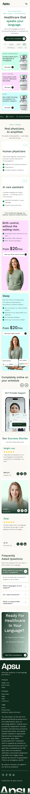

# 首页 UI / UX 总览

> 2026-09-17 · P1 读稿基线。UI Tailor 编排、同一 agent 以 Monet 职责复核。
> [设计系统](../design-system.md) 是全局视觉真源；[交互草案](interactions.md) 只描述待实现行为。所有区块当前均未实装。

## 用户任务与视觉路径

理解「用自己的语言获得线上医疗服务」→ 了解三类产品 → 看服务方式与价格 → 查看体重管理相关信息 → 阅读支持方式、证言与 FAQ → 使用相应 CTA。首页不承担诊断、登录或支付后台。状态只能表达实际发生的操作，不能用成功提示模拟未接入服务。

## 14 个页面区块

编号是未来页面组合顺序，不等于 Figma 顶层 frame 数；Header / Footer 使用原生地标，其余有标题的区块用 section。Hero 包含 LanguageMarquee，WeightLoss 包含介绍与套餐，Sleep 包含静态 Profile，FinalCta 从 Footer 复合实例中抽出。这样拆为 14 个实际职责，不把 Profile 误拆成第二个 BMI。

| # | 区块 | 桌面节点 | 移动节点 | 运行边界 / 原语 | 布局与内容依据 |
|---|---|---|---|---|---|
| 1 | Header | `2002:3100` | `2002:3682`；打开态 `2002:4211` | Client；Button、IconButton | 桌面 logo / 4 导航 / 2 CTA，移动折叠菜单 |
| 2 | Hero | `2002:3119`（文案 `2002:3120`） | `2002:3688` | Server；Button；嵌套 Client LanguageMarquee + Chip / Marquee | 唯一 h1；三条提示、文案、主 CTA、双行语言标签 |
| 3 | ServiceCards | `2002:3189` | `2002:3758` | Server；Card、Button | 三列变单列；Weight Management / Birth Control / Sleep；不是轮播 |
| 4 | TrustMarquee | `2002:3214` | `2002:3780` | Client；Marquee | 深绿横条，两板都有，内容循环；父级镜像使 XML x 看似出板，以截图为准 |
| 5 | HowItWorks | `2002:3262` | `2002:3828` | Server；Card | 两张职责卡桌面并排、移动堆叠；尾句强调医生负责医疗决定 |
| 6 | WeightLoss | `2002:3308` + `2002:3333` | 板外 `2002:4114` + `2002:4136` | Server；Card、Button | 介绍 + 两款套餐；移动主板缺失，按候选 #1 待批准补入 |
| 7 | BmiCalculator | `2002:3352`（表单 `2002:3355`、结果 `2002:3411`） | 板外空壳 `2002:4155` | Client；NumberField、RadioGroup、SegmentedControl、Button、Card | 桌面表单 / 结果双栏；移动内容缺失，布局与初始状态待候选 #1 / #5 批准 |
| 8 | BirthControl | `2002:3440` | `2002:3873` | Server；Button | 桌面左文右图，移动先文后图；移动稿省略桌面介绍段，不擅自补回 |
| 9 | Sleep | `2002:3467` | `2002:3895` | Server；Button、Card | 桌面左图右文，移动先文后图；Profile 数据卡仅是展示 |
| 10 | OnlineCare | `2002:3521` | `2002:3943` | Server 外壳 + Client Carousel；Card、IconButton | “Completely online…”；4 张服务卡，桌面约三张多、移动一张多；箭头属于这里 |
| 11 | SuccessStories | `2002:3586` | `2002:4008` | Server；Card、Rating | 两段文本证言 + 一张照片卡；桌面三列，移动三张堆叠，无轮播箭头 |
| 12 | Faq | `2002:3667` | `2002:4089` | Client（既有白名单）；Accordion | 首题默认打开；桌面文案 / 列表双栏、移动上下排 |
| 13 | FinalCta | `2002:3678` 内上方 CTA（实例子 ID 未在 XML 展开） | `2002:4100` | Server；Button | 桌面横向、移动标题居中 / CTA 底置；共享实例不是独立节点，勿虚构 ID |
| 14 | Footer | `2002:3678` 内下方页脚 | `2002:4112` | Server；链接 / 品牌素材 | 品牌、3 列链接、声明、社交、版权与底部巨型 logo；移动纵向 |

LanguageMarquee 精确来源：桌面 `2002:3138` / 移动 `2002:3707`。这 14 行是页面组合单元；LanguageMarquee 是 Hero 内部可复用交互岛，Carousel 是 OnlineCare 使用的原语，不重复计为首页区块。

## 页面锚点与链接契约

| 入口 | 目标 / 拟定 id | 状态 |
|---|---|---|
| logo | `/`（页面顶部） | 单页路由内导航 |
| Weight Loss（Header / Menu / Footer / 入口卡） | `#weight-loss` | PROJECT 已批准；由 WeightLoss 根容器承载 |
| Birth Control（同上） | `#birth-control` | PROJECT 已批准；BirthControl 根容器承载 |
| Sleep（同上） | `#sleep` | PROJECT 已批准；Sleep 根容器承载 |
| WeightLoss 内 See plans；BMI 结果 See your GLP-1 Options | `#weight-loss-plans` | 页面内套餐子容器；实施时随交互登记 |
| Footer FAQs | `#faq` | Faq 根容器 |
| Header Contact Us / Footer Contact Us | props 的真实 `href`；未从稿中取得 | 候选 #12；不能默认把它伪装成联系表单 |
| Get started / consultation / Login / About / Blogs / Legal / Footer 社交 | props 的真实 `href`；未从稿中取得 | 候选 #12；不建 `/coming-soon`，不编造外站或真实登录流程 |

移动产品导航：关闭菜单，再滚到目标；目标标题可程序聚焦但不额外加入常规 Tab 序列。只有关闭按钮 / Escape 的普通关闭回到菜单触发按钮；导航关闭时将焦点送到目标内容，避免焦点留在已经关闭的层里。滚动减动效时立即完成。实际 header 若采用 sticky，P5 为目标设置合适 scroll-margin；P1 不自行认定稿件要求 sticky。

## 响应式与图片边界

- 375 / 1440 按原图及已批准 C 类修正比对；其他宽度执行 [RESPONSIVE](../../features/RESPONSIVE.md) 的 `sm / lg / xl` 规则。Header 展开阈值需 P5 实测，不能靠这轮截图宣称 1024 已通过。
- 移动内容宽 335、外壳宽 351；桌面主内容 1320、外壳 1384。页面容器最大 1440，卡片 / 文本允许内容撑高。
- 所有页面文字、图片、金额、链接来自 props / schema；图片按 `{ src, alt, width, height }`。像素化 logo、人物、药瓶、聊天示意与社交图形的来源需 P5 导出登记；不能把生成 context 的临时 URL 留在代码里。
- OnlineCare 的横向裁切是轮播视窗内的设计意图，外层页面不得横向溢出。SuccessStories 的三张卡必须在移动全部可见。
- Profile / 聊天是静态视觉说明，不应出现可聚焦的假输入框、电话或发送按钮；正文仍有独立文案供理解服务。证言卡社交图标按已批准决定为装饰。

## 全区块盘点

| 区块范围 | 核对结果 / 候选 |
|---|---|
| Header / Menu | 原稿开闭两态明确；缺真实目标的 CTA 归 #12 |
| Hero / LanguageMarquee | 主次层级清晰；语言标签俄语与阿拉伯语黏连 #7；小字对比度 #10；选中视觉未定义选择行为 #11 |
| ServiceCards | 布局明确；三类服务复用 Tirzepatide 药瓶，部分标题与图片重叠 #9 |
| TrustMarquee | 两板均存在，关闭旧 #3；“Issuance” 拼写 #4 |
| HowItWorks | 两板内容可对应；“Health Harbor” 只是旧图层名，关闭旧 #2 |
| WeightLoss / BMI | 移动主板缺块、BMI 空壳 #1；零输入 / 56 / 范围标签 #5；标题语法 #6；Semaglutide 卡药瓶不符 #9 |
| BirthControl / Sleep | 保留两板各自排版与移动正文省略；Profile 不是独立页面步骤 |
| OnlineCare | 真实轮播位置；卡片标题 “Easy Manager Treatment” #8 |
| SuccessStories | 不是轮播；移动副标题 text box 362 大于容器 335，但短句居中无可见溢出；实现用内容宽，纳入 P6 长文检查 |
| Faq | 默认第一题开；其余三题隐藏 body 复用错误 #13 |
| FinalCta / Footer | 纵横重排明确；“Comapny” #4；其余链接 / 动作缺目标 #12 |

候选的唯一待办在 [TODO](../../TODO.md)，这里保留定位结果；没有执行任何 C/D 修正。设计审查已完成，真实页面的视觉与操作验收归 P4–P7。
